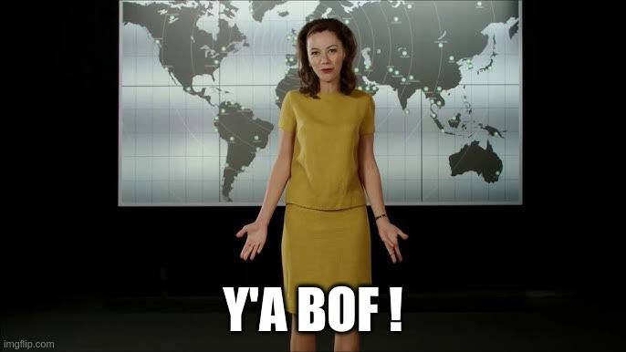

# FCSC 2025 yabof

Yet Another Buffer Overflow!

Fichiers :
- [yabof](yabof)

Auteur : [Cryptanalyse](https://twitter.com/Cryptanalyse)

Origine : [yabof](https://hackropole.fr/fr/challenges/pwn/fcsc2025-pwn-yabof/)

-----------

## Connectez vous en WEBSSH
> http://localhost

#### tentez 
> nc yabof.cyrhades.fr 4000

-----------

## Ou directement avec netcat
> nc localhost 4000

-----------

## Installation manuel
Vous n'utilisez pas l'application **les CTFs de Cyrhades** ? C'est dommage !
Mais voici comment installer ce CTF manuellement :

> git clone https://github.com/Hack-Oeil/fcsc2025-pwn-yabof.git

> cd fcsc2025-pwn-yabof

-----------

## Sur le site officiel hackropole.fr
> https://hackropole.fr/fr/challenges/pwn/fcsc2025-pwn-yabof/